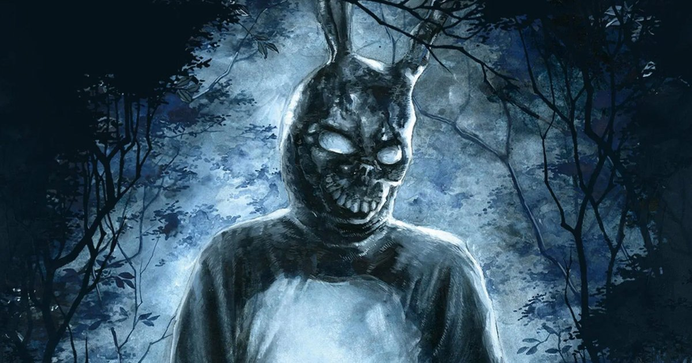
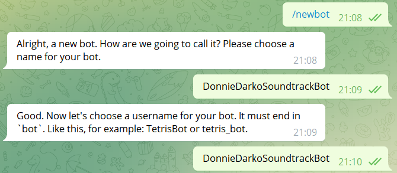
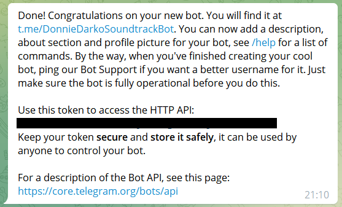
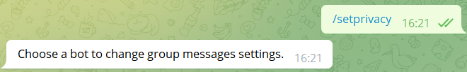
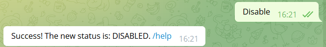

> Donnie Darko: Why are you wearing that stupid bunny suit?

> Frank: Why are you wearing that stupid man suit?

# Donnie Darko Soundtrack - Telegram Bot (@DonnieDarkoSoundtrackBot)

Simples bot para a prática de criação de bot para o TELEGRAM.

Primeiro passo: Criar o bot no Telegram

1. No Telegram, chame o @BotFather

2. Use o comando /newbot, crie o nome do bot e o username. O final do username deve conter 'bot':

3. Você vai receber um aviso de que tudo ocorreu certo e um token. É muito importante que você guarde esse dado como uma senha.

4. (Opcional) Este quarto passo é necessário caso você queira que seu bot seja capaz de responder o usuários do grupo sem a necessidade de chamar o comando com '/', isto é, se você digitar a palavra X do seu código o bot vai responder automaticamente.

Digite /setprivacy: 

5. (Opcional) Digite o @ do bot que você vai alterar as configurações e coloque Disable:

Agora seu bot já está pronto para o código!

Segundo Passo:

Criar o arquivo [bot.py](bot.py)

